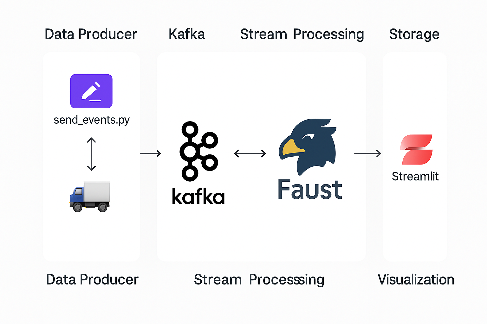

# Kafka-Faust-DuckDB Telematics Demo 🚚

This project is a real-time telematics pipeline that simulates vehicle location and speed data using Kafka, processes it with Faust, stores it in DuckDB, and visualizes it with a live Streamlit dashboard.

## 📦 Components

- **Kafka**: Message broker used to stream vehicle telemetry.
- **Faust**: Stream processing framework to consume Kafka topics and persist events.
- **DuckDB**: Embedded analytical database to store event data.
- **Streamlit**: Dashboard to visualize vehicle movement and speed in real-time.

## 📊 Architecture Overview

<!-- #MAKE THE IMAGE SMALLER BY 50% -->
<div>
    
</div>

## 🚀 How to Run

> **Requirements**: Docker + Docker Compose

```bash
# Clone the repo
git clone https://github.com/klailatimad/kafka-faust-duckdb-demo.git
cd kafka-faust-duckdb-demo

# Start all services
docker compose up --build
```

### 1. Data Producer (send_events.py)

In a separate terminal, run the Kafka event producer:

```bash
python send_events.py
```

This script generates random vehicle data and sends it to the `telematics` Kafka topic.

### 2. Dashboard

Access the Streamlit dashboard at:

```
http://localhost:8501
```

You can view:

-   Latest vehicle positions on a map
    
-   Speed trends over time
    
-   Filter by vehicle ID
    

## 🛠 Next Improvements

-   🧭 Simulate smoother, realistic movement on fixed routes
    
-   🗺️ Animate live vehicle paths on the map
    
-   📊 Add more metrics: average speed, distance travelled, speed violations
    
-   🔍 Enable real-time filtering and alerting
    
-   📦 Containerize the producer script
    
-   ✨ Polish UI for clarity and aesthetics
